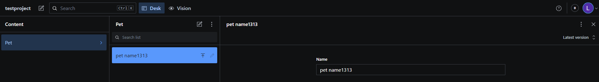

## Info

* SSG - https://astro.build/  
* SSG tutorial - https://www.sanity.io/guides/sanity-astro-blog/
* CMS - https://www.sanity.io/

## Code

Adresar frontend obsahuje SSG generator a sablony stranek. Adresar studio obsahuje `Sanity studio` pro editaci dat (to pak bezi na vlastni domene u nas)

Vsechno dulezity se nacita v kodu [tady](frontend/src/pages/index.astro)
1. v CMS se nadefinuje content [model](studio/schemas/pet.js) - struktura dat, ktery chci zobrazovat
2. v CMS se nadefinuje content - napisu vlastni obsah
3. SSG vygenerovani stranky - skript mezi `---` se spousti pri generovani staticky stranky
    * z CMS se stahnout data
    * data se poslou do sablony, kde se zobrazi jako list
4. Sanity studio se pak da self-hostovat [takhle](https://www.sanity.io/docs/deployment#ed3cd78ea4eb)
5. build studia (adresar studio) `npm run build` - vysledek je v adresari `dist`
6. build statickych stranek (adresar frontend) 'npm run build' - vysledek je v adresari `dist`
7. oboji se pak nahraje na nas web server - [web](http://test-sanity.rigu.cz/) a [studio](https://test-sanity.rigu.cz/studio)

## Content

